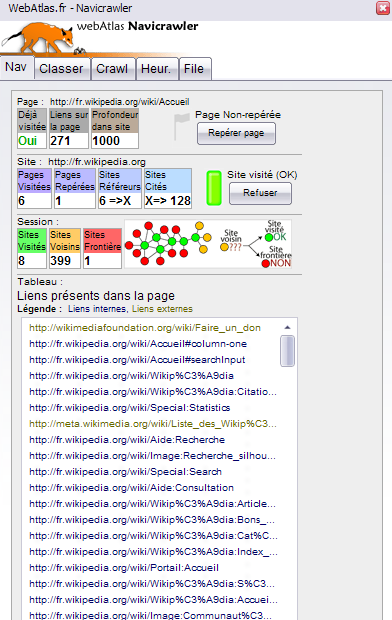

# Navicrawler

---

Some methodological documentation can be found in the [`doc`](doc) directory.  

---

Ce logiciel est libre ; vous pouvez le redistribuer et/ou le
modifier dans les termes énoncés par la Licence Générale Publique
telle que publiée par la Fre Software Fondation ; dans sa version 3
ou toute autre version ultérieure.

Ce programme est distribué dans l'espoir qu'il sera utile, mais
sans garantie d'aucune sorte.

La License Générale Publique GNU est disponible dans sa version
anglaise originale dans le fichier "copying.txt".

Consultez les informations en anglais pour plus d'informations.

---

This program is free software; you can redistribute it and/or modify
it under the terms of the GNU General Public License as published by
the Free Software Foundation; either version 2 of the License, or
(at your option) any later version.

This program is distributed in the hope that it will be useful,
but WITHOUT ANY WARRANTY; without even the implied warranty of
MERCHANTABILITY or FITNESS FOR A PARTICULAR PURPOSE.  See the
GNU General Public License for more details.

You should have received a copy of the GNU General Public License
along with this program; if not, write to the Free Software
Foundation, Inc., 51 Franklin St, Fifth Floor, Boston, MA  02110-1301  USA

## Credits

Copyright 2006, 2007 Mathieu Jacomy

Développeurs : Mathieu Jacomy, Anne L'Hôte
 
Contact :
Mathieu Jacomy
mathieu.jacomy@gmail.com
http://webatlas.fr

